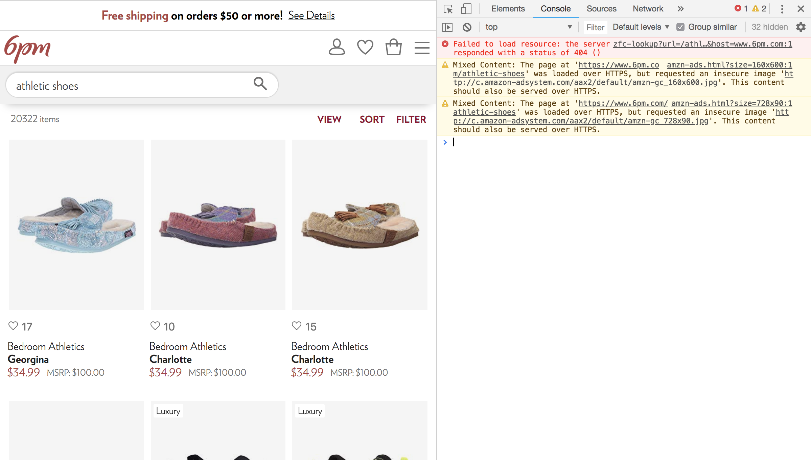

Answer the following questions in a questions.md file in your repository:

What do the numbers inside the parentheses after a function name do?
The number inside the parentheses determine the status of a function, such as changing color value, size of canvas, and location of a object, etc.

What’s the difference between fill and stroke?
Fill refers to the certain space inside selected area, and this function will fill the area with some selected color.
Stroke only refers to the line around one object.

The p5 web editor has a built-in console — but it turns out that Chrome also has a console to display errors. Do some googling to find out how you can open the Chrome console. Then, try to find a website that has errors — visit a website, open the console, and see if there are any red-highlighted items. Take a screenshot and upload it into your repository!

What is the keyboard shortcut to open the JavaScript console in Chrome?
Mac: option + command + J
Windows: command + shift + J

